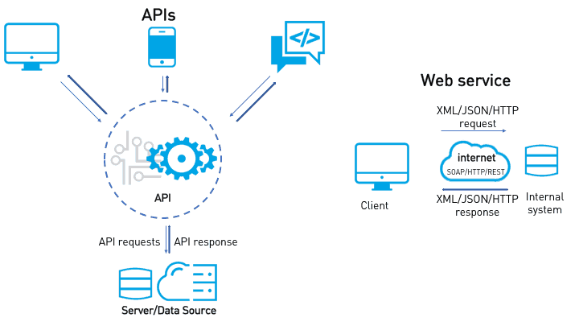

Web-Service
=========================

## Web-Services Made `Simple.`
    

webservice enables you to script a sequence of calls to any kind of web-service and assert that the responses are as expected.  It makes it really easy to build complex request payloads, traverse data within the responses, and chain data from responses into the next request. Karate's payload validation engine can perform a 'smart compare' of two JSON or XML documents without being affected by white-space or the order in which data-elements actually appear, and you can opt to ignore fields that you choose.

webservice is the only open-source tool that combines web-API testing and [test-doubles](karate-netty) into a single, *unified* test automation framework. And you can re-use API Functional Tests as [Performance Tests](karate-gatling) !

Since Karate is built on top of [Cucumber-JVM](https://github.com/cucumber/cucumber-jvm), you can run tests and generate reports like any standard Java project. But there is also a [stand-alone executable](karate-netty#standalone-jar) for teams that are not comfortable with Java. And you can write tests in a language-neutral syntax designed to make dealing with HTTP, JSON, GraphQL or XML - **simple**. 

## Diagram

> If you are familar with Cucumber, the [*big difference*](#cucumber-vs-karate) here is that you **don't** need to write extra "glue" code or Java "step definitions" !
